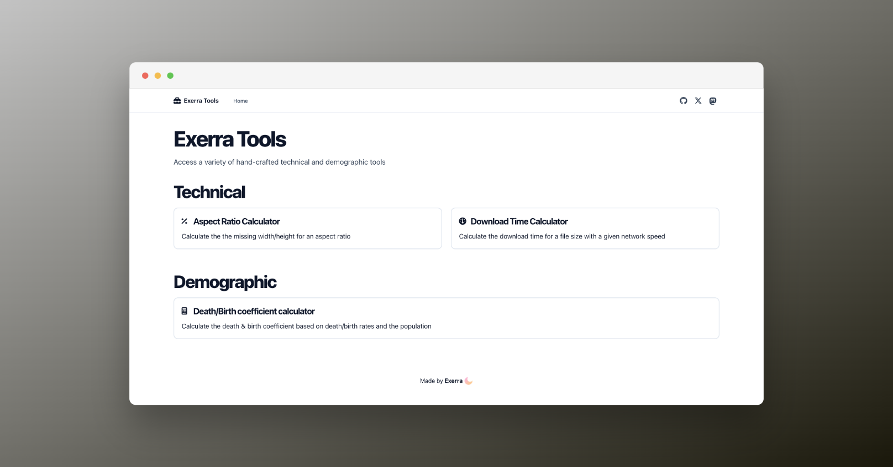

# Exerra tools

This is a toolbox of various hand-crafted technical and demographic tools that I occasionally have the need for.

## Goals
As of writing, all the tools here are basically glorified calculators with specific formulas. I wish to expand it to have other categories as well as have more advanced tools.

### Ideas:
- [ ] Gamepad tester
- [ ] Gradient + wave generator
- [ ] Microphone tester (spectrum analyser + spectogram)
- [ ] JSON to TS types

## Built with...
- [Astro](https://astro.build)
- React
- Fontawesome
- TailwindCSS
- humanize-duration (Download Time Calculator)
- astro-seo
- astro-spa